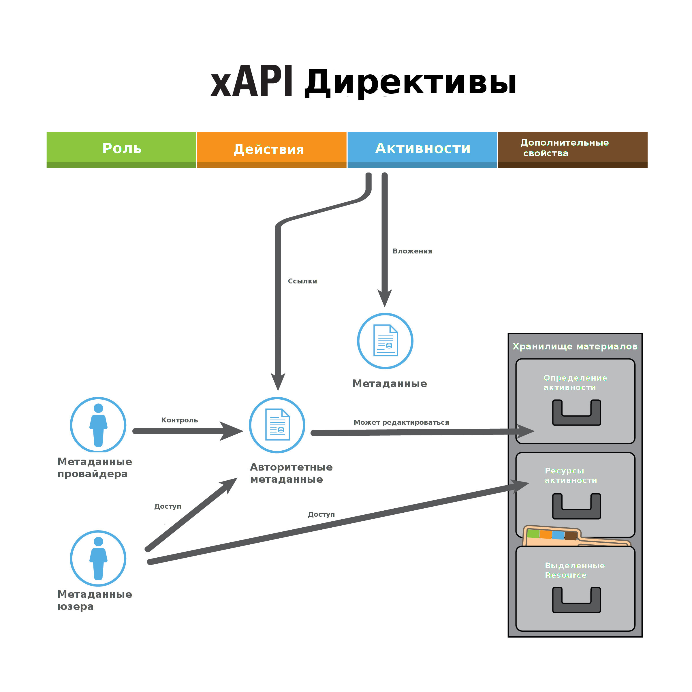
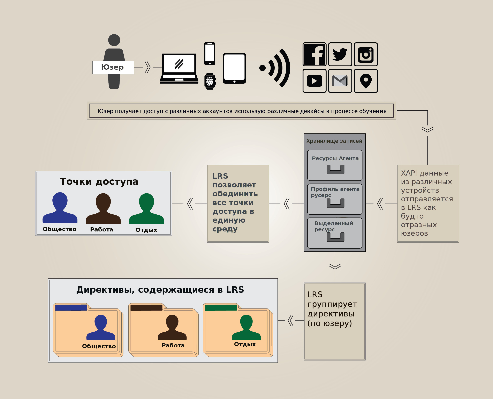

# xAPI-SpecRu
## Расширенное распределенное обучение (ADL) Co-Laboratories
## Advanced Distributed Learning (ADL) Co-Laboratories
## (Вольный перевод от Timtroll https://github.com/adlnet/xAPI-Spec)

>#### Timtroll (вольный перевод спецификации)

>"Copyright 2013 Advanced Distributed Learning (ADL) Initiative, U.S. Department of Defense

>Licensed under the Apache License, Version 2.0 (the "License"). You may not use this file except 
>in compliance with the License. You may obtain a copy of the License at
>http://www.apache.org/licenses/LICENSE-2.0

> Если не предусмотрено действующим законодательством или согласования в письменной форме, программное обеспечение распространяется 
> "как есть" БЕЗ КАКИХ ЛИБО ГАРАНТИЙ И УСЛОВИЙ явных или подразумеваемых. Смотри Лицензию на родном языке которая регулирует права и
> ограничения по данной Лицензии.

> Данный документ составлен членами Experience API Working Group (смотри список в [CONTRIBUTING.md](CONTRIBUTING.md#contributors))
> при поддержке Deputy Assistant Secretary of Defense (Readiness) Advanced Distributed Learning (ADL) Initiative. Все замечания 
> и отклики посылайте сюда helpdesk@adlnet.gov

## Содержание
*	Часть первая:	[Про xAPI](./xAPI-About.md#partone)
	*	1.0.	[Введение](./xAPI-About.md#introduction-partone) 
	*	2.0.	[Как использовать данный документ](./xAPI-About.md#readingguidelines)
		*	2.1.	[Обязано быть / Как есть / Возможно будет](./xAPI-About.md#def-must-should-may)
	 	*	2.2.	[Руководство для Interpreting Descriptive Text и Tables](./xAPI-About.md#interpret-text-table)
	*	3.0.	[Сериализация и JavaScript Object запись](./xAPI-About.md#json)
	*	4.0.	[Определения](./xAPI-About.md#definitions) 
	*	5.0.	[xAPI компоненты](./xAPI-About.md#xapi-components) 
	*	6.0.	[Расширения xAPI](./xAPI-About.md#extending-xapi) 
	*	7.0.	[Профили и Комьюнити на практике](./xAPI-About.md#COPs)
	*	[Приложения](./xAPI-About.md#append1)
		*	[Приложение A: регистрация изменений](./xAPI-About.md#Appendix1A)
		*	[Приложение B: cmi5 примеры](./xAPI-About.md#Appendix1B)
*	Часть вторая:	[Данные xAPI](./xAPI-Data.md#parttwo)
	*	1.0.	[Документация](./xAPI-Data.md#documents) 
	*	2.0.	[Формулировки](./xAPI-Data.md#statements)
		*	2.1.	[Общая цель](./xAPI-Data.md#statement-purpose)
	 	*	2.2.	[Требования к форматированию](./xAPI-Data.md#dataconstraints) 
	 		*	2.2.s1 [Подробности](./xAPI-Data.md#datadetail) 
	 		*	2.2.s2 [Требования](./xAPI-Data.md#datarequirements) 
		 	*	2.3.s3	[Требования к Learning Record Provider](./xAPI-Data.md#lrsarequirements)
	 	*	2.3.	[Директивы о жизненном цикле](./xAPI-Data.md#lifecycle) 
		 	*	2.3.1.	[Директивы неизменяемости](./xAPI-Data.md#statement-immutability-and-exceptions) 
		 	*	2.3.2.	[Аннулирование](./xAPI-Data.md#voided)
   		*	2.4.	[Директива свойствах](./xAPI-Data.md#statement-properties)
	        *	2.4.1.	[ID](./xAPI-Data.md#stmtid)
	        *	2.4.2.	[Actor](./xAPI-Data.md#actor)
	        *	2.4.3.	[Действия](./xAPI-Data.md#verb)
	        *	2.4.4.	[Object](./xAPI-Data.md#object)
	        *	2.4.5.	[Result](./xAPI-Data.md#result)
	        *	2.4.6.	[Context](./xAPI-Data.md#context)
	        *	2.4.7.	[Timestamp](./xAPI-Data.md#timestamp)
	        *	2.4.8.	[Stored](./xAPI-Data.md#stored)
	        *	2.4.9.	[Authority](./xAPI-Data.md#authority)
	        *	2.4.10.	[Version](./xAPI-Data.md#version)
	        *	2.4.11.	[Attachments](./xAPI-Data.md#attachments)
    	*	2.5.	[Исправления(Восстановления)](./xAPI-Data.md#retrieval) 
    	*	2.6.	[Подписи](./xAPI-Data.md#signature)
	*	3.0.	[Metadata](./xAPI-Data.md#metadata)
		*	3.1.	[IRI Requirements](./xAPI-Data.md#iri-requirements)
		*	3.2.	[Hosted Metadata](./xAPI-Data.md#miscmeta)
    *	4.0.	[Спациальные типы данных и правила](./xAPI-Data.md#special-data)
		*	4.1.	[Расширения](./xAPI-Data.md#miscext) 
		*	4.2.	[Карта языков (Language Maps)](./xAPI-Data.md#lang-maps)
		*	4.3.	[IRIs](./xAPI-Data.md#iris)
		*	4.4.	[UUIDs](./xAPI-Data.md#uuids)
		*	4.5.	[ISO 8601 Timestamps](./xAPI-Data.md#timestamps)
		*	4.6.	[ISO 8601 Durations](./xAPI-Data.md#durations)
	*	[Приложения](./xAPI-Data.md#append2)
		*	[Приложение A: Примеры директив](./xAPI-Data.md#Appendix2A)
		*	[Приложение B: Примеры директив различных типов](./xAPI-Data.md#Appendix2B)
		*	[Приложение C: Примеры определений активностей для типа "cmi.interaction"](./xAPI-Data.md#Appendix2C)  	
		*	[Приложение D: Примеры подписанных директив](./xAPI-Data.md#Appendix2D)
*	Часть третья:	[Обработка данных, Валидация и Безопасность](./xAPI-Communication.md#partthree)
	*	1.0.	[Запросы](./xAPI-Communication.md#requests)
		*	1.1.	[Реализация HEAD Request](./xAPI-Communication.md#httphead)
	 	*	1.2.	[Headers](./xAPI-Communication.md#headers) 
	 	*	1.3.	[Альтернативный синтаксис запроса](./xAPI-Communication.md#alt-request-syntax) 
	 	*	1.4.	[Encoding](./xAPI-Communication.md#encoding) 
	 	*	1.5.	[Content Types](./xAPI-Communication.md#content-types) 
	        *	1.5.1.	[Application/JSON](./xAPI-Communication.md#applicationjson) 
	        *	1.5.1.	[Multipart/Mixed](./xAPI-Communication.md#multipartmixed)
	*	2.0.	[Ресурсы](./xAPI-Communication.md#datatransfer) 
	 	*	2.1.	[Объявление Resource](./xAPI-Communication.md#stmtres) 
	 	*	2.2.	[Документы Resources](./xAPI-Communication.md#doctransfer) 
	 	*	2.3.	[Государственный Resource](./xAPI-Communication.md#stateres) 
	 	*	2.4.	[Агентский Resource](./xAPI-Communication.md#agentsres) 
	 	*	2.5.	[Активности Resource](./xAPI-Communication.md#activitiesres) 
	 	*	2.6.	[Профиль агента Resource](./xAPI-Communication.md#agentprofres) 
	 	*	2.7.	[Активности профиля Resource](./xAPI-Communication.md#actprofres) 
	 	*	2.8.	[Описание Resource](./xAPI-Communication.md#aboutresource) 
   	*	3.0.	[Валидация данных](./xAPI-Communication.md#validation)
    	*	3.1.	[Совпадения](./xAPI-Communication.md#concurrency)
    	*	3.2.	[Коды ошибок](./xAPI-Communication.md#errorcodes)
    	*	3.3     [Версионность](./xAPI-Communication.md#versioning)
    *	4.0.	[Аутентификация](./xAPI-Communication.md#authentication)
		*	4.1.	[OAuth 1.0 сценарии и методы](./xAPI-Communication.md#authdefs) 
		*	4.2.	[OAuth 1.0 объемы авторизации](./xAPI-Communication.md#oauthscope)
    *	5.0	[Безопасность](./xAPI-Communication.md#security)
	*	[Приложения](./xAPI-Communication.md#append3)
		*	[Приложение A: Преобразование отчетности в 1.0.0](./xAPI-Communication.md#Appendix3A)
		*	[Приложение B: Таблица всех ресурсов](./xAPI-Communication.md#Appendix3B)
		*	[Приложение C: Примеры кроссдоменныъ запросов](./xAPI-Communication.md#Appendix3C)

<a name="partone" />
#Часть первая: Про xAPI

<a name="introduction-partone"></a>
## 1.0 Введение

xAPI - техническая спецификация, которая направлена ​​на описание связей обучающих документов и опыта обучения.
Она определяет структуры для описания учебного процесса и получения опыта и определяет, каким образом эти описания будут 
храниться обменены в электронном виде.

xAPI это результат инициативы Advanced Distributed Learning (ADL). ADL был создан в 1997 году для
стандартизации и модернизации обучения и управления образованием и доставки в США. С тех пор наблюдается
растущее осознание необходимости отслеживать опыта обучения лиц за пределами формального, структурированного компьютерного обучения.
При оценке пригодности кандидатов на должности или их возможности для выполнения различных задач, возникает необходимость
рассмотреть широкий спектр формального и неформального опыта обучения, в том числе в автономном режиме. Данная информация,
собрана из широкого круга источников.

Именно поэтому родилось сообщество и спецификация xAPI. xAPI предполагает, что:
  * Существует необходимость, анализа информации о получениия опыта в процессе обучения и его результатов, распределенных по
  разным источникам.
  * Разработка широко признается как ориентир для сбора, хранения и обмена этой информацией и представляет лучший способ
  достижения этой цели.

xAPI разработан для того:

* Чтобы было легче понять и сравнить опыт обучения и его результаты которые регистрируются с помощью разных платформ и технологий.
* Чтобы обеспечить максимальную совместимость услуг по сбору, хранению и обработке информации о получении опыта при обучении.
* Чтобы обеспечить связное руководство для тех, кто хочет создавать приложения, которые будут соответствуют и реализовать эту спецификацию.
* Чтобы обеспечить критерии для проверки соответствия данной спецификации.

В документе изложены спецификации xAPI, которая предназначена для достижения перечисленных целей.

<a name="readingguidelines"></a>

## 2.0 Как использовать данный документ

Это окончательный документ, который описывает как нужно реализовывать xAPI. Данная спецификация  является техническим документом для отдельных лиц и организаций, реализующих эту технологию с целью развития функционально совместимых инструментов, систем и услуг, которые не зависят друг от друга и в состоянии взаимодействовать друг с другом.

Всякий раз, когда это возможно, язык и форматирование, используемое в данном документе, предназначен для рассмотрения нетехническими читателями, так как различные инструменты, системы и услуги основаны на наборе спецификаций, описанных ниже. По этой причине, разделы, которые обеспечивают высший уровень данного xAPI помечены **Описание** или **обоснование**. Элементы в этом документе помечены как **требования** , **подробности** или **примеры** носят более технический характер.

Данная спецификация разделяется на три части. Часть первая это введение. Он предлагает некоторые общие описания, обобщения на высоком уровне и рекомендации как читать остальную часть спецификации.

Во второй части этой спецификации определяет модель данных для различных объектов данных, которые используются в данном описании. Наиболее значимым объектом в модели данных xAPI является объект "Директива". Эта спецификация определяет свойства Директив (в том числе "Актер", "Действие", "Объект", "Результат" и "Контекст") и правила синтаксиса для значений этих свойств и как они представлены. Эта часть помогает гарантировать, что услуги, реализующие спецификации будут следовать определенным структурам данных.

В третьей части данной спецификации изложены методы передачи, которые должны использоваться при обмене информацией о получении опыта между службами, которые придерживаются данной спецификации. Это включает в себя формат запросов и ожидаемых ответов. Обратите внимание, что общение в xAPI не ограничивается "Learning Record Store" (LRS) получением данных из "content". LRS могут взаимодействовать с услугами, начиная от "Learning Record Providers" и "Learning Record Consumers" в другие LRS. xAPI следует рекомендациям REST архитектуры для программного обеспечения. Такие данные передаются с помощью HTTP-запросов и ответов. Часть третья также определяет методы защиты, позволяющие обезопасить обмен информацией между LRS и доверенными "Clients".

<a name="def-must-should-may"></a>
### 2.1 Обязано быть / Как есть / Возможно будет

Есть три уровня обязательностьи следования спецификачии xAPI - ДОЛЖНО, РЕКОМЕНДУЕТСЯ и МОЖЕТ. Служба или система, которая не выполняет требование ДОЛЖНО (или НЕ ДОЛЖНО) является несовместимой. Неудовлетворение требования ДОЛЖНО не является нарушением, но идет вразрез с рекомендациями спецификации. Нарушение требований РЕКОМЕНДУЕТСЯ указывает на возможность разных решений разработчиков без каких-либо последствий для соответствия. Полные описания ДОЛЖНО, РЕКОМЕНДУЕТСЯ и МОЖЕТ (MUST, SHOULD, MAY, MUST NOT and SHOULD NOT) вы найдете в [RFC 2119](https://www.ietf.org/rfc/rfc2119.txt).

<a name="interpret-text-table"></a>
### 2.2 Руководство для Interpreting Descriptive Text и Tables

Как правило, требевания представляется как обязательное, интерпретирего именно так. Это особенно касается более подробных объяснений и таблиц, каждая из которых может быть неинтуитивной и/или подробной.

Таблицы используются в для более четкого определения требований к спискам свойств, параметров и т.д.
Таблицы определяют какие свойства "обязательны", "рекомендованы" или "по-желанию". Как правило, понятие "по-желанию" относится к созданию объекта, в то время как услуги приема и интерпретации объекта "обязательны", чтобы у систем был возможность корректно интерпретировать все свойства объекта. Часто, свойства не являются обязательными, поскольку данные не могут быть актуальны в любом контексте; если данные актуальны в конкретном контексте, то ожидается, свойство будет заполняться.

Если свойство или параметр "по-желанию"  содержит объект со свойствами, которые "обязательны" или "рекомендованы", то эти свойства "обязательны" или "рекомендованы" для объектов, которые их используют.

Примеры приведены в описании и в Приложениях для иллюстрации реализации. Содержание этих Примеров является вымышленным, чтобы проиллюстрировать требования спецификации и не всегда могут проиллюстрировать подход к отслеживанию конкретного процесса обучения, который используется в примере. Примеры могут быть использованы для информирования толкования требований, но не предназначены для того, чтобы иметь приоритет над требованиями. 

В случае, если спецификация не включает в себя требования, относящиеся к конкретной реализации, нужно стараться придерживаться общих рабмок и подходов данной спецификации. Данная спецификация пытается избежать неясности и, как правило, дает логическое обоснование, даже если там нет требования в конкретной области.

<a name="json"></a>
## 3.0 Сериализация и JavaScript Object запись

Сериализация процесс преобразования объектов данных и структуры в формат для хранения или передачи, таким образом, что исходный объект данных могут быть воссозданы из полученной сериализации. В некоторых случаях возможно сериализовать часть данных более чем одним способом. Например, логическое свойство со значением, соответствующим истинным могут быть представлены в виде `true` или `1` в зависимости от используемого типа  сериализации.

xAPI следует правилам JSON для сериализации (так логические значения представлены в виде `true` или `false`). Возможно также представлять объекты с использованием других типов сериализации, например XML. Но это выходит за рамки данной спецификации. Данная спецификация использует исключительно JSON для представления объектов.

Даже в пределах правил JSON есть возможны различные варианты сериализации, особенно в отношении данных о времени. Это имеет большое значение, так как ряд особенностей xAPI полагается на системы, которые в состоянии определить, что два утверждения эквивалентны между собой. Смотри [Неизменность и исключения](./xAPI-Data.md#заявление-неизменность-и-исключения) для получения более подробной информации о свойствах Заявления которые могут пострадать от этого.

JSON позволяет объектам иметь свойства, которые содержат пустые объекты, но это не рекомендуется посылать в xAPI; если заявление не содержит данные о свойстве, то ожидается, что свойство не будет использоваться вовсе. Все необходимые свойства ДОЛЖНЫ содержать значения.

<a name="definitions"></a>
## 4.0 Определения

* [Активности](#def-activity)
* [Провайдер активностей (AP)](#def-activity-provider)
* [Роль](#def-actor)
* [API](#def-api)
* [Аутентификация](#def-authentication)
* [Авторизация](#def-authorization)
* [Сообщество практиков](#def-community-of-practice)
* [Описание профиля Resource](#def-document-profile)
* [Endpoint](#def-endpoint)
* [xAPI](#def-experience-api)
* [Неизменяемость](#def-immutable)
* [Интернационализированный идентификатор ресурсов (IRI)](#def-iri)
* [Интернационализированный указатель ресурса (IRL)](#def-irl)
* [Обратный функциональный идентификатор](#def-inverse-functional-identifier)
* [Опыт обучения](#def-learning-experience)
* [Система управления обучением (LMS)](#def-learning-management-system)
* [Обучающая запись](#def-learning-record)
* [Обучающая запись юзера (LRC)](#def-learning-record-consumer)
* [Обучающая запись провайдера (LRP)](#def-learning-record-provider)
* [Хранилище обучающих записей (LRS)](#def-learning-record-store)
* [Метаданный юзера](#def-metadata-consumer)
* [Метаданные провайдера](#def-metadata-provider)
* [Персона/Persona](#def-persona)
* [Профиль/Profile](#def-profile)
* [Регистрация](#def-registration)
* [REST](#def-rest)
* [Сервис/Service](#def-service)
* [Директива/Statement](#def-statement)
* [Tin Can API (TCAPI)](#def-tcapi)
* [Термины](#def-verb)
* [Словарь](#def-vocabulary)

<a name="def-activity" ></a>Активность

__Activity__: Тип объекта, составляющие понятие "это" в выражении "Я сделал это"; это что-то, с которым взаимодействовал Актер. Это может быть единицей обучения, получения опыта или производительность, которые будут отслеживаться в значимой комбинации с Действием. Интерпретация довольно широка, а это означает, что Активностью могут быть даже материальные объекты, такие как стул (реальный или виртуальный). В заявлении "Анна попыталась рецепт пирога", рецепт представляет собой Активность с точки зрения Директивы xAPI. Другие примеры Активности включают в себя книги, электронный учебный курс, поход, или встречу.

<a name="def-activity-provider" ></a> Провайдер Активности (Activity Provider - AP)

__Activity Provider (AP)__: В настоящее время так называется поставщик услуг обучения (Learning Record Provider). Это говорит о том, что сама Активность не всегда соответствует программному обеспечению, а является только частью отслеживания.

<a name="def-actor" ></a> Актер (юзер)

__Actor__: Индивидуальное или групповое представление отслеживается с помощью инструкций выполнения Директив в рамках Активности. Это и есть понятине "я" в сентенции "я сделал это".

<a name="def-api" ></a> API

__Application Programming Interface (API)__: Набор правил и стандартов, созданный для обеспечения доступа r программноve приложению или инструменту.

<a name="def-authentication" ></a> Аутентификация

__Authentication__: Концепция проверки личности. Аутентификация позволяет разрещить взаимодействие между двумя "доверенными" лицами.

<a name="def-authorization" ></a> Авторизация

__Authorization__: Применимость прав доступа, основанная на ролях; процесс создания одной стороны "доверенной" другой

<a name="def-client" ></a> Клиент (Client)

__Client__: Относится к любой сущности, которая может взаимодействовать через запросы. В качестве примера можно привести Learning Record Provider, Learning Record Consumer, Learning Record Store (LRS) или Learning Management System (LMS).

<a name="def-community-of-practice" ></a>

__Community of Practice (CoP)__: Группа практиков, связанных общим делом, ролях или цели, которая действует в общих интересах. Группа сосредоточена на реализации xAPI в рамках конкретной области знаний или использования. Группа или независимые разработчики могут создавать предметно-ориентированные словари, профили и рецепты. Такая практика, как правило, связана с работой вокруг определения вариантов использования и курирования различных терминов словаря, синонимов и других связанных метаданных, которые могут быть предпочтительными в пределах Группы. Они также могут использовать существующие словари, профили и рецепты уже опубликованные другими Группами или участниками сообщества xAPI.

<a name="def-document-profile" ></a>

__Document Profile Resource__: Конструкция, где информация об учащемся или Активности сохраняется, как правило, в виде пар имя/документ, и которые имеют значение в учебной составляющей системы. Не следует путать с [Профиль](#def-профиль).

<a name="def-endpoint" ></a>

__Endpoint__: Точка входа в сервис. xAPI отражает этот подход с ресурсами, определив IRI, из которого происходит коммуникация в качестве конечной точки.

<a name="def-experience-api" ></a>

__Experience API (xAPI)__: Совокупность правил, сформулированных в этом документе, которые определяют как - определять опыт обучения, форматировать и обмениваться таким образом, чтобы сторонние программы могли обмениваться и использовать эту информацию.

<a name ="def-immutable" ></a> Неизменямость

__Immutable__: Понятие используется для описания вещей, которые не могут быть изменены. За некоторыми исключениями, Директивы в xAPI неизменны. Это гарантирует, что, когда Директивы распределяются между LRS, множественные копии Директив остаются прежними.

<a name="def-iri" ></a> Уникальный идентификатор ресурса (IRI)

__Internationalized Resource Identifier  (IRI)__: Уникальный идентификатор, который может быть IRL. Используется для идентификации объекта, такого как Действие, Активность или вида Активности. В отличие от URIs, IRIs может содержать некоторые символы за пределами списка ASCII.

IRIs всегда включают в себя схему. Это не является требованием настоящего стандарта, но часть определения IRIs согласно [RFC 3987] (http://www.ietf.org/rfc/rfc3987.txt). То, что иногда называют "relative IRIs" не является IRIs.

<a name="def-irl" ></a> IRL

__Internationalized Resource Locator (IRL)__:  В контексте этого документа, то IRL является IRI, что при переводе в URI (согласно IRI правилам - URI), является URL.

<a name="def-inverse-functional-identifier" ></a> Обратный Функциональный идентификатор (Inverse Functional Identifier)

__Inverse Functional Identifier__: Идентификатор, который является уникальным для конкретной персоны или группы.

<a name="def-learning-experience" ></a> Опыт обучения (Learning Experience)

__Learning Experience__: Событие, связанное с обучением. Примеры включают в себя - чтение книги, онлайн курс, поход на экскурсию, самостоятельные зянятия или получение сертификата по завершеннии курса.

<a name="def-learning-management-system" ></a> Learning Management System (LMS)

__Learning Management System (LMS)__: "Пакет программного обеспечения, используемого для управления одним или более курсами для одного или более учеников. LMS обычно представляет собой веб-система, которая позволяет учащимся проходить проверку подлинности, зарегистрироваться на курсы, проходить курсы и получать оценки "(определение Learning Systems Architecture Lab). 

LMS в данном документе используется в качестве примера того, как в системе идентифицируется "доверенный" пользователь и получает доступ к его процессу обучения.

<a name="def-learning-record" ></a> Learning Record

__Learning Record__: Запись полученного опыта, который отформатирован в соответствии с правилами xAPI. Learning Record принимает различные формы, в том числе Директивы, документы, а также их составные части. 

<a name="def-learning-record-consumer" ></a> Learning Record Consumer (LRC)

__Learning Record Consumer (LRC)__: Клиент xAPI, который получает доступ к данным из Learning Record Store (LRS) с целью обработки данных, в том числе интерпретации, анализа, перевода, распространения и агрегации.

<a name="def-learning-record-provider" ></a> Learning Record Provider (LRP)

__Learning Record Provider (LRP)__: Клиент xAPI, который отправляет данные в Learning Record Store (LRS). Часто это Learning Record 
Provider (LRP), который будет создавать отчеты по обучению при мониторинге ученика для ведения учебного процесса.

<a name="def-learning-record-store" ></a>Learning Record Store (LRS)

__Learning Record Store (LRS)__: Сервер (т.е. система, способная принимать и обрабатывать веб-запросы), который отвечает за прием, хранение и обеспечение доступа к процессу обучения.

<a name="def-metadata-consumer" ></a>Metadata Consumer

__Metadata Consumer__: Человек, организация, программа или еще что-то/кто-то, которые стремятся определить значение представленого в IRI и  используется в данном описании для извлечения метаданные об IRI. LRS может быть или может не быть потребителем метаданных.

<a name="def-metadata-provider" ></a>Metadata Provider

__Metadata Provider__: Человек, организация, программа или еще что-то/кто-то, использующие IRIs метаданные через IRI.

<a name="def-persona" ></a>Persona

__Persona__: Набор из одного или нескольких представлений, которые однозначно определяют Актера. Концептуально, это походит на наличие "home email"/"work email". Это один и тот же человек, но имеющий разные данные о себе.

<a name="def-profile" ></a>Profile

__Profile__: Специфический набор правил и документации для реализации xAPI в определенном контексте. Профили обычно обеспечивают определенный словарь терминов, некоторые созданы специально для профиля, а некоторые из них ссылаются на другие словарей. Иногда профиль может предоставить несколько словарей для различных ситуаций, а иногда кто-то может собирать словарь из нескольких источников без создания профиля. Не следует путать с [Document Profile Resource](#def-документ-профиль).

<a name="def-registration" ></a>Registration

__Registration__: Инстанс Актера, который проводит определенную Активность.

<a name="def-rest" ></a>Representational State Transfer (REST)

__Representational State Transfer (REST)__: Архитектура для разработки сетевых веб-сервисов. Опирается на методы HTTP и использует лучшие веб практики.

<a name="def-service" ></a>Service

__Service__: Компонент программного обеспечения, ответственный за распределение одного или более аспектов процесса обучения. Например, LMS -  сочетает в себе множество услуг, чтобы создать полный цикл обучения.

<a name="def-statement" ></a>Директива (Statement)

__Statement__: Структура данных, показывающая како рода опыт или событие будет отслеживаться в xAPI как Learning Record. Набор из нескольких Директив, каждая из которых представляет собой событие во времени, и может быть использована для отслеживания всей информацию о качестве получения учебного опыта.

<a name="def-tcapi"></a>Tin Can API (TCAPI)

__Tin Can API (TCAPI)__: Предыдущее название API, описанного текущим документом, часто используется в неформальных ссылок на xAPI.

<a name="def-verb" ></a>Действие (Verb)

__Verb__: Действие которое производится Актером в рамках Активности в Директиве.
Например Действие "сделал" в предложении "я сделал это".

<a name="def-vocabulary" ></a>Vocabulary

__Vocabulary__: Перечень или совокупность терминов, которые используются в комьюнити для маркировки или категоризации информации в той или иной области. Использование словаря гарантирует, что каждый использует то же слово в одинаковом смысле. Для получения более подробной информации о словарях смотри [xAPI Vocabulary Companion Specification](https://github.com/adlnet/companion-specification-for-xapi-vocabularies/blob/master/SUMMARY.md).

<a name="xapi-components" ></a>

## 5.0 xAPI компоненты

В этом разделе объясняется и наглядно показывается, как различные части xAPI работают вместе.

##### Отслеживание опыта

###### Figure 1: Потоки данных в xAPI


На рисунке 1 показано отслеживание получение опыта в процессе обучения. Учащийся получает опыт. Этот опыт человек может получать в онлайн-курсе, как на работе, так и в любом другом месте. Этот опыт отслеживается доверенным Learning Record Provider (LRP). Learning Record Provider может также нести ответственность за соотнесение полученного опыта и обучающемся. Это может включать в себя запуск воспроизведения контента для обучаемого и управления цифровыми правами, связанными с содержанием.

Learning Record Provider создает Learning Records и отправляет их на один или несколько оLearning Record Stores (LRSs). LRS сохраняет 
Learning Records и делает их доступными для любого авторизованного Клиента. Learning Record Consumer (LRC) - тип Клиента, который получает доступ к Learning Records и использует их.

##### Активности и метаданные

###### Figure 2: xAPI активности и метаданные


Описание того, как одна Активность (которая однозначно идентифицируется своим IRI) определяется, описывается и является ключевым понятием в xAPI. На рисунке 2 показан этот процесс. Активность (как часть Директивы) имеет свойства метаданных, которые могут быть внесены внутри самой Директивы. Это делается с помощью Statement's Activity Definition. Идентификатор каждого вида Активности является IRI, который также может содержать метаданные в IRI. Любые метаданные, которые резолвятся IRI находятся под контролем Metadata 
Provider. Metadata Provider несет ответственность за то, чтобы IRI являлись постоянными и работали правильно.

Любые метаданные расположеные в IRI являются авторитетным источником метаданных, и могут быть использованы для заполнения канонической версии  метаданных Активности (LRS Activity Definition) также как метаданные, полученные от Директивы. Metadata Consumer может получить доступ к метаданным через IRI если он "авторитетен" или может запросить Activities Resource для получения канонической версии.

##### Управление агентами и юзерами

###### Figure 3: xAPI Управление агентами и юзерами


xAPI предоставляет основу для обеспечения возможности выборочного доступа к своим персональным данным. Это делается с помощью управления так называемых персонами. В xAPI, каждый персонаж представляется как "Я" в предложении "Я сделал это" и  предметом Директивы. Каждый Агент или Группа в xAPI соответствует персоне. Учащийся отправляет Learning Records в LRS b может иметь несколько персон (Агентов), связанных с ним или с ней.

На рисунке 3, обучающийся получает доступ к нескольким службам. Некоторые из этих услуг используются на работе, другие дома. Некоторые из них используются для социального общения, а другие используются для образовательных или профессиональных целей. Таким образом, существует несколько персонам функционирующих коллективно в рамках этих услуг. Каждая из этих услуг посылает данные в LRS. После этого, Директивы от трех разных персонажей одного и того же ученика.

ЛРП может агрегировать всю информацию каждого из персонажей в один объект "лицо". Этот объект может быть извлечен из LRS через [Agents Resource](./xAPI-Communication.md#agentsres). Как LRS узнает, что эти многочисленные персонажи принадлежат к одному человеку выходит за рамки данной спецификации и существует несколько различных подходов, которые могут реализовываться в LRS. Кроме того, возможно, что некоторые LRS не будут иметь никакого механизма для ассоциирования персонажей.

<a name="extending-xapi" ></a>

## 6.0 Расширения xAPI

xAPI может быть расширен несколькими способами. Наиболее явная возможность расширения Директив, которые допускают большую гибкость в Директивах. Комьюнити рекомендует как использовать расширения для их конкретных случаев и использовать профили всякий раз, когда это возможно. Детали реализации описаны тут [4.1 Расширения](./xAPI-Data.md#miscext).

About Resource является еще одним примером, где xAPI поддерживает расширения. Функции для общения или поведения LRS лежат за пределами данной спецификации. LRS могут использовать расширения к About Resourc для создания таких связей.

И, наконец, набор ресурсов, реализованных как описано, не ограничиваться данным документом. Ресурсы не перечисленых в настоящем описании могут быть реализованы и сосуществовать с ресурсами, определенными в данном описании.

<a name="COPs" ></a>

## 7.0 Профили и Комьюнити на практике

xAPI строго определяет структуру Директив, но является очень гибкой для контента этой структуры. Например, спецификация требует, чтобы все Директивы имели свойство "verb", но не ограничивает значения этого свойства; может быть использовано любое Действие 'verb'. Такая гибкость позволяет bспользоваnm xAPI в любом контексте, в том числе возможных случаев применения в будущем, не предусмотренных авторами спецификации.

Предполагается, что [Communities of Practice (CoPs)](#def-community-of-practice) будет определять Действия, виды Активностей, контекстные отношения, расширения и т.д., которые будут использоваться в профилях, предоставляя уникальные идентификаторы, где это применимо. Комьюнити будет определять эти идентификаторы и их метаданные в [Vocabulary](#def-vocabulary). Профиль представляет собой набор правил и словарей, чтобы осуществляться в дополнение к xAPI для конкретного случая использования. Очень важно, что такие сообщества существуют для обмена передовым опытом. Для получения более подробной информации о публикации словарей смотрите в [Vocabulary Companion Specification](https://adl.gitbooks.io/companion-specification-for-xapi-vocabularies/content) и [Vocabulary Primer](https://adl.gitbooks.io/experience-xapi-vocabulary-primer/content/).

Рекомендуется использовать профиль уникальной "категории" в контексте Директивы, чтобы ссылаться на любую Директиву, которая реализует профиль. Пример профиля [cmi5](https://github.com/AICC/CMI-5_Spec_Current), который предназначен для одного обучающегося, одного онлайн-обучения. Пример Директивы cmi5 можно найти в [Приложение B: cmi5 Example](#Appendix1B).

Копы настоятельно рекомендуется избегать дублирования, так как создает слишком много способов решить ту же задачу, что приведет к фрагментации и потенциально может навредить совместимости. Примером CoP для медицинской области является [MedBiquitous Learning Experience Working Group](http://groups.medbiq.org/medbiq/display/XIG/Learning+Experience+Group+Home).

<a name="append1"></a>
## Приложения

<a name="Appendix1A"></a>
### Приложение A: История
###### 1.0.2 to 1.0.3 (September 21, 2016)
- Complete reorganization of the document into three parts
- Many, many clarifications
- Definitions slightly modified and greatly clarified
- Removed back-references to SCORM
- Additional explanatory text and diagrams
- Rename Statement API and Document APIs to Statement Resource and Document Resources

[1.0.2...1.0.3](https://github.com/adlnet/xAPI-Spec/compare/1.0.2...1.0.3)

<a name="Appendix1B"></a>
### Приложения B: cmi5 Примеры 

Следующий пример иллюстрирует заявление следующего за cmi5 Сообщество практики. Он демонстрирует использование расширений
и "category" contextActivities.

```
{
  "id":"2a41c918-b88b-4220-20a5-a4c32391a240",
  "actor":{
    "objectType":"Agent",
    "name":"Gert Frobe",
    "account":{
      "homePage":"http://example.adlnet.gov",
      "name":"1625378"
    }
  },
  "verb":{
    "id":"http://adlnet.gov/expapi/verbs/failed",
    "display":{
      "en-US":"failed"
    }
  },
  "object":{
    "id":"https://example.adlnet.gov/AUidentifier",
    "objectType":"Activity"
  },
  "result":{
    "score":{
      "scaled":0.65,
      "raw":65,
      "min":0,
      "max":100
    },
    "success":false,
    "duration":"PT30M",
    "extensions":{
      "https://w3id.org/xapi/cmi5/result/extensions/progress":100
    }
  },
  "context":{
    "registration":"ec231277-b27b-4c15-8291-d29225b2b8f7",
    "contextActivities":{
      "category":[
        {
       	  "id":"https://w3id.org/xapi/cmi5/context/categories/moveon"
        },
        {
          "id":"https://w3id.org/xapi/cmi5/context/categories/cmi5"
        }
      ]
    },
    "extensions":{
      "https://w3id.org/xapi/cmi5/context/extensions/sessionid":"458240298378231"
    }
  },
  "timestamp":"2012-06-01T19:09:13.245+00:00"
}
```

